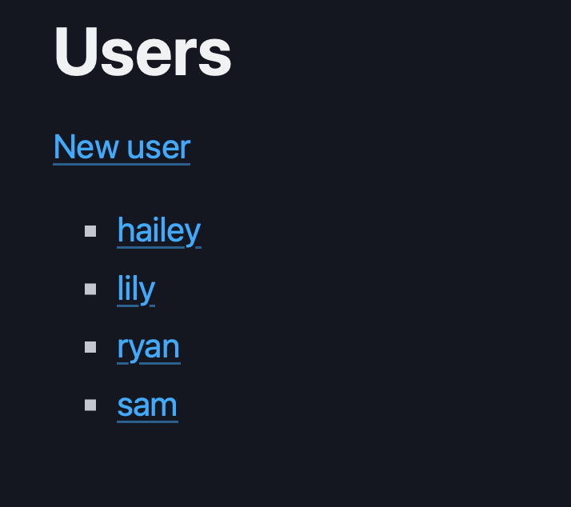
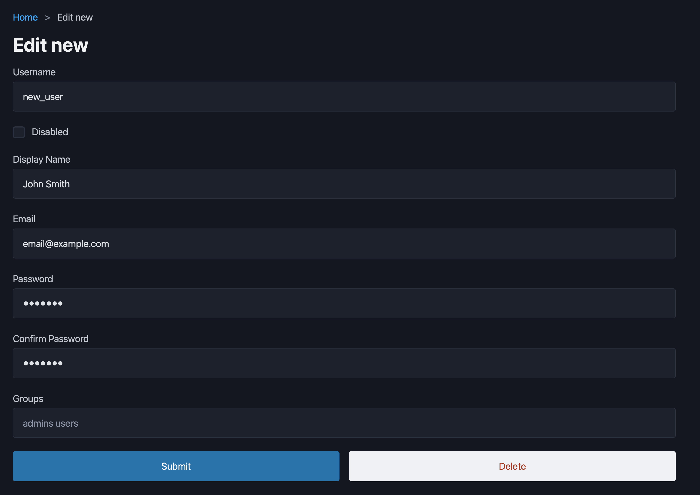

# Authelia User Tool

The Authelia User Tool is a simple admin dashboard to add and remove users in an Authelia users db YAML file.

It is designed to be run behind reverse proxy with proper forward auth setup. Its intended audience are homelabs and simple users.




# Example setup with Caddy and Docker Compose

Here is a simple Docker Compose setup:

```yaml
services:
  caddy:
    container_name: caddy
    image: caddy
    restart: unless-stopped
    cap_add:
      - NET_ADMIN
    ports:
      - "80:80"
      - "443:443"
      - "443:443/udp"
    volumes:
      - ./appdata/caddy/Caddyfile:/etc/caddy/Caddyfile
      - ./appdata/caddy/data:/data
      - ./appdata/caddy/config:/config
    networks:
      - default
      - user-admin

  aut:
    image: ghcr.io/ursuscamp/aut:master
    container_name: aut
    volumes:
      - ./appdata/authelia/config/users_database.yml:/config/users.yml
    restart: unless-stopped
    networks:
      - user-admin

networks:
  user-admin:
```

A few things to note here:

1. AUT doesn't publish any ports on the host.
2. AUT occupies its own network which Caddy connects to.
3. There is a volume mapping from the Authelia users file to `/config/users.yml` in the AUT container. If you plan to run this without docker, you can set the `AUT_USERS_FILE` environment variable to change the path where the user file is expected to be found.

1 and 2 are recommended because AUT doesn't implement any auth on its own. So we put AUT behind a reverse proxy with forward auth, not exposing any ports on the host and segregated to its own network to avoid exposure other docker containers in my project.

Here's how to setup the Caddyfile:

```Caddyfile
aut.example.com {
        forward_auth authelia:9091 {
                uri /api/authz/forward-auth
        }

        reverse_proxy aut:5555
}
```

And you can setup access control in Authelia:

```yaml
access_control:
  default_policy: "deny"
  rules:
    - domain: "aut.example.com"
      policy: "one_factor"
      subject: ["group:admin"]
```

Now we have assured that the AUT dashboard is not available outside of the host, from other containers on the host, and not available to any user not currently logged into Authelia as a member of the admin group.
